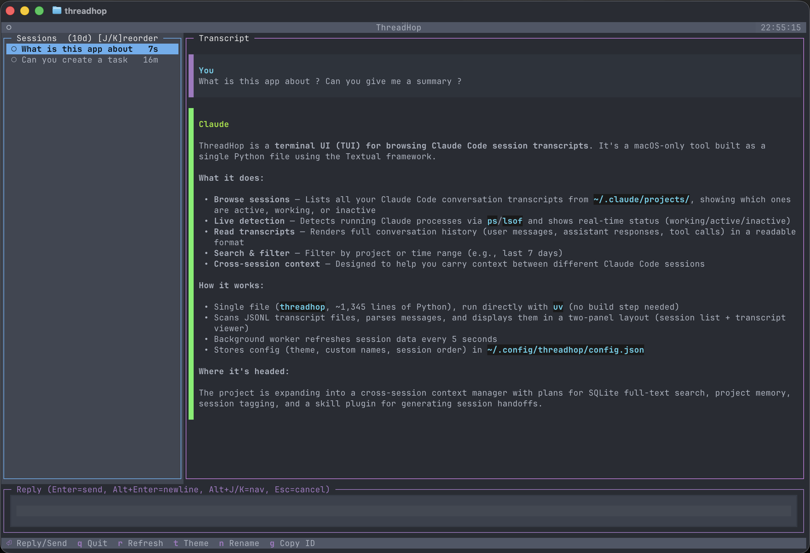

# ThreadHop

Cross-session context manager for Claude Code.



A terminal app that turns isolated Claude Code sessions into a connected workspace — browse transcripts, search across sessions, and carry context between them.

## Install

Requires macOS and [uv](https://github.com/astral-sh/uv). That's it.

```bash
ln -s /path/to/threadhop/threadhop ~/bin/threadhop
```

## Usage

```bash
threadhop                              # all sessions
threadhop --project myproject          # filter by project
threadhop --days 7                     # last 7 days only
```

## Keybindings

### Navigation

| Key | Action |
|-----|--------|
| `j` / `k` | Navigate sessions (in session list) |
| `h` / `l` | Focus session list / transcript |
| `left` / `right` | Focus session list / transcript |
| `PageUp` / `PageDn` | Scroll transcript |
| `Home` / `End` | Jump to top / bottom of transcript |

### Sessions

| Key | Action |
|-----|--------|
| `Enter` | Focus reply input (or send if already focused) |
| `/` | Focus reply input |
| `Alt+Enter` | Insert newline in reply |
| `Alt+j` / `Alt+k` | Navigate sessions while reply input is focused |
| `Escape` | Cancel reply / exit selection mode |
| `n` | Rename session |
| `g` | Copy `claude -r <id>` to clipboard |
| `J` / `K` | Reorder sessions (move up/down) |
| `Shift+Up` / `Shift+Down` | Reorder sessions (move up/down) |
| `s` / `S` | Cycle session status forward / backward |
| `a` | Toggle archive on selected session |
| `A` | Show / hide archived sessions |

### Message Selection (focus transcript first with `l`)

| Key | Action |
|-----|--------|
| `m` | Enter / exit selection mode (starts at last message) |
| `j` / `k` or `Down` / `Up` | Move selection between messages |
| `v` | Start / cancel range selection (anchor + extend) |
| `Escape` | Exit selection mode |

### Display

| Key | Action |
|-----|--------|
| `t` / `T` | Cycle theme forward / backward |
| `[` / `]` | Shrink / grow sidebar |
| `r` | Refresh session list |
| `q` | Quit |

## Tagging sessions from inside Claude Code

Use Claude Code's `!` bash passthrough to tag the current session without leaving the chat. The `!` prefix runs the command in the host shell — no LLM turn, instantaneous — and `threadhop tag` auto-detects the session by walking the parent process tree for its `claude` ancestor.

```
!threadhop tag in_review
```

Output:

```
✓ tagged 8f3b2a1c as in_review
```

Valid statuses: `active`, `in_progress`, `in_review`, `done`, `archived`.

The TUI reflects the new status on its next refresh (5s). From another terminal tab, pass the id explicitly instead: `threadhop tag in_review --session <id>`.

If detection fails (e.g. running outside a Claude Code terminal), the command exits `2` with a helpful error and no DB write.

### Optional: `/tag` via a UserPromptSubmit hook

Prefer a slash-style trigger? A Claude Code `UserPromptSubmit` hook can intercept `/tag <status>`, shell out to `threadhop tag`, and block the prompt from reaching the model. Note: hooks are not surfaced in `/` autocomplete or `/help` — `!threadhop tag` remains the recommended, discoverable surface. The hook below is purely for users who want the slash ergonomics.

1. Drop this script at `~/.claude/hooks/threadhop-tag.sh` and `chmod +x` it:

    ```bash
    #!/usr/bin/env bash
    INPUT=$(cat)
    PROMPT=$(printf '%s' "$INPUT" | jq -r '.prompt')
    if [[ "$PROMPT" =~ ^/tag[[:space:]]+([A-Za-z_]+)[[:space:]]*$ ]]; then
      STATUS="${BASH_REMATCH[1]}"
      threadhop tag "$STATUS" >&2
      exit 2   # blocks the prompt — it never reaches the model
    fi
    exit 0
    ```

2. Register it in `~/.claude/settings.json`:

    ```json
    {
      "hooks": {
        "UserPromptSubmit": [
          {
            "matcher": "",
            "hooks": [
              { "type": "command", "command": "~/.claude/hooks/threadhop-tag.sh" }
            ]
          }
        ]
      }
    }
    ```

The hook reads the prompt from stdin as JSON, matches `/tag <status>`, invokes `threadhop tag`, and exits `2` — which tells Claude Code to block the submission and show the stderr output to the user.

## Bookmarking from inside Claude Code

Use the same `!` bash passthrough pattern to bookmark the current conversation without opening the TUI first.

General keep-for-later bookmark against the latest message in the current session:

```bash
!threadhop bookmark
```

Research follow-up bookmark with a short note:

```bash
!threadhop bookmark research --note "compare retry strategies later"
```

Output:

```text
✓ bookmarked kind=research session=8f3b2a1c-... message=6d2e... role=assistant text="We should compare retry strategies later." note="compare retry strategies later"
```

Targeting rules:

- Session auto-detect works the same way as `threadhop tag`: inside a live Claude Code terminal it walks the parent process tree for the current `claude` session.
- Without `--message`, ThreadHop bookmarks the latest indexed message in that session.
- If you need a specific message, pass `--session <id> --message <uuid>`.
- Built-in classes are intentionally narrow for now: `bookmark` and `research`.

The ingest path is shared and deterministic: chat commands use the same bookmark primitive that future TUI actions can call later.

### Optional: `/bookmark` and `/research` via a UserPromptSubmit hook

Prefer slash-style triggers? This hook blocks the prompt before it reaches the model and shells out to `threadhop bookmark`.

1. Drop this script at `~/.claude/hooks/threadhop-bookmark.sh` and `chmod +x` it:

    ```bash
    #!/usr/bin/env bash
    set -euo pipefail
    INPUT=$(cat)
    PROMPT=$(printf '%s' "$INPUT" | jq -r '.prompt')
    if [[ "$PROMPT" =~ ^/bookmark([[:space:]]+(.*))?$ ]]; then
      NOTE="${BASH_REMATCH[2]-}"
      if [[ -n "$NOTE" ]]; then
        threadhop bookmark --note "$NOTE" >&2
      else
        threadhop bookmark >&2
      fi
      exit 2
    fi
    if [[ "$PROMPT" =~ ^/research([[:space:]]+(.*))?$ ]]; then
      NOTE="${BASH_REMATCH[2]-}"
      if [[ -n "$NOTE" ]]; then
        threadhop bookmark research --note "$NOTE" >&2
      else
        threadhop bookmark research >&2
      fi
      exit 2
    fi
    exit 0
    ```

2. Register it in `~/.claude/settings.json` the same way as the `/tag` example above.

This gives you two low-friction chat-side buckets now, while keeping the app-side bookmark model ready for later generalized categories.

## Observer Lifecycle

Start the background observer for the current Claude Code session from inside
the chat:

```bash
!threadhop observe
```

Or target a specific session from another terminal:

```bash
threadhop observe --session <id> &
```

Stop and resume use the persisted `observation_state` row. The observer handles
`SIGTERM` gracefully: it flushes any pending tail, advances
`source_byte_offset`, marks the row `stopped`, and exits cleanly. A later
`threadhop observe` resumes from the recorded byte offset instead of re-reading
the full transcript.

```bash
threadhop observe --stop
threadhop observe --stop --session <id>
threadhop observe --stop-all
```

### Optional: hook-driven auto-start

If you want observer auto-start on every prompt for sessions where it is
enabled, first persist the flag:

```bash
threadhop config set observe.enabled true
```

Then register a lightweight `UserPromptSubmit` hook that launches
`threadhop observe` in the background. The command is safe to run repeatedly:
it auto-detects the current session and exits immediately when an observer is
already running for that session.

1. Drop this script at `~/.claude/hooks/threadhop-observe.sh` and `chmod +x` it:

    ```bash
    #!/usr/bin/env bash
    set -euo pipefail

    if [[ "$(threadhop config get observe.enabled 2>/dev/null)" == "true" ]]; then
      threadhop observe >/dev/null 2>&1 &
    fi
    ```

2. Register it in `~/.claude/settings.json`:

    ```json
    {
      "hooks": {
        "UserPromptSubmit": [
          {
            "hooks": [
              { "type": "command", "command": "~/.claude/hooks/threadhop-observe.sh" }
            ]
          }
        ]
      }
    }
    ```

## Roadmap

- Cross-session search (SQLite FTS5, per-keystroke)
- Range selection (`v`), clipboard copy (`y`), and temp-file export (`e`) with source labels
- Project memory — append-only ledger of decisions, TODOs, ADRs
- Handoff generation — compress a session into a brief via `/threadhop:handoff`
- Codex support

See [docs/DESIGN-DECISIONS.md](docs/DESIGN-DECISIONS.md) for the full architecture.

## Docs

- [Origin & Attribution](docs/ORIGIN.md)

## License

MIT. Originally forked from [thomasrice/claude-sessions](https://github.com/thomasrice/claude-sessions).
