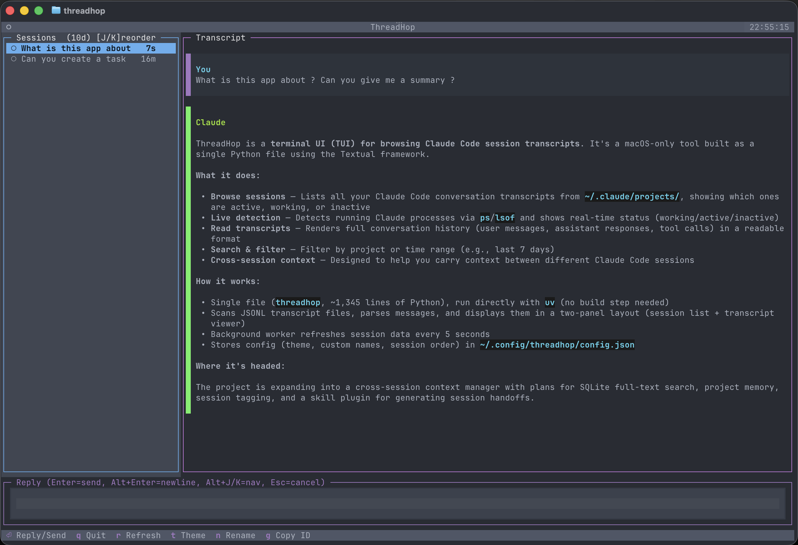

# ThreadHop

Persistent, searchable, cross-session memory for Claude Code — a TUI, a CLI, and a Claude Code plugin that share one SQLite store.



Each Claude Code session ships as an isolated JSONL transcript. ThreadHop indexes them into SQLite with FTS5 and lets you borrow context across sessions on a spectrum: instant, zero-LLM `peek` and `search` into any other session, and one-LLM-call transfer tickets (`prepare` → `receive`) when you want to continue work in another chat. The TUI is the main browser; most day-to-day use happens from inside the Claude Code chat via `!threadhop …` bash passthrough or the `/threadhop:*` plugin commands.

### What's in the box

- **TUI** — two-column browser over `~/.claude/projects/**/*.jsonl`, with FTS search, bookmarks, status tags, message-range selection, AI-generated session titles.
- **CLI** — `threadhop peek / search / prepare / receive / tag / bookmark / copy`, all auto-detecting the current session from the parent process tree so they work inside a live `claude` chat.
- **Borrow surface** — `peek` and `search` read other sessions verbatim with zero LLM calls; `prepare` builds a frozen transfer ticket with exactly one Haiku call, and `receive` pastes it into any chat.
- **Claude Code plugin** (`plugin/`) — `/threadhop:peek`, `/threadhop:prepare`, `/threadhop:receive`, `/threadhop:tag`, `/threadhop:bookmark`, `/threadhop:copy` commands under the `/threadhop:` namespace.

## Install

macOS only. The installer handles everything — including installing [uv](https://github.com/astral-sh/uv) if you don't have it.

### Quick install (recommended)

```bash
curl -LsSf https://raw.githubusercontent.com/parzival1l/threadhop/main/install.sh | bash
```

This clones the repo to `~/.local/share/threadhop`, installs `uv` if missing, and symlinks `threadhop` into `~/.local/bin`. Re-run the same command any time to update.

### Manual install

If you'd rather not pipe curl to bash, the same three steps by hand:

```bash
# 1. Install uv (skip if you already have it)
brew install uv    # or: curl -LsSf https://astral.sh/uv/install.sh | sh

# 2. Clone and link
git clone https://github.com/parzival1l/threadhop.git ~/.local/share/threadhop
mkdir -p ~/.local/bin
ln -s ~/.local/share/threadhop/threadhop ~/.local/bin/threadhop

# 3. Make sure ~/.local/bin is on your PATH (add to ~/.zshrc if not)
export PATH="$HOME/.local/bin:$PATH"
```

Verify with `threadhop --version`.

### Claude Code integration

Once the CLI is installed, add the plugin to get the `/threadhop:*` slash commands. From inside any `claude` session:

```
/plugin marketplace add parzival1l/threadhop
/plugin install threadhop@threadhop
```

That registers the six commands — `/threadhop:peek`, `/threadhop:prepare`, `/threadhop:receive`, `/threadhop:tag`, `/threadhop:bookmark`, `/threadhop:copy` — persistently across all future sessions. The plugin is a thin wrapper over the CLI, so the `threadhop` command must already be on your `$PATH` (see above) for the slash commands to do anything.

**Dev / local-testing path**: if you've cloned the repo and want to load the plugin against a working-tree copy for one session, `claude --plugin-dir ~/.local/share/threadhop/plugin` loads it for that invocation only (no persistence).

## Updating ThreadHop

Once installed you can refresh the CLI in place, without re-running the curl installer:

```bash
threadhop update               # pull latest origin/main (git fetch + reset --hard)
threadhop update --check       # just report, don't pull
threadhop update --to v0.1.0   # pin to a tag, branch, or SHA (rollback)
threadhop update --force       # override the dirty-tree safety guard
threadhop changelog            # what's new
threadhop future               # top 5 roadmap entries
```

`threadhop update` refuses to run if the installed checkout has uncommitted changes or is on a branch other than `main`, because `git reset --hard` would silently discard that work. Use `--force` to override once you're sure.

ThreadHop also checks once per 24 hours for a newer release and nudges you on the next CLI invocation (three-line stderr message) or TUI launch (transient toast). The check is suppressed inside Claude Code sessions (`!threadhop …` or `/threadhop:*`), in pipelines (`threadhop search --json | jq`), and when `THREADHOP_NO_UPDATE_CHECK=1` is set in your shell environment.

The Claude Code plugin has its own update channel — run `/plugin update threadhop` from inside any `claude` session to refresh the slash commands.

## Usage

### TUI

```bash
threadhop                              # all sessions
threadhop --project myproject          # filter by project
threadhop --days 7                     # last 7 days only
```

### CLI

All subcommands accept `--project` and `--session`; without them they auto-detect the current session.

```bash
threadhop peek <session> [--last N] [--range A:B] [--grep PATTERN]
                                  # print cleaned verbatim exchanges from another session (zero LLM)
threadhop search <query> [--project P] [--limit N] [--json]
                                  # FTS5 keyword search across all indexed sessions (zero LLM)
threadhop prepare [--session <id>] [--tail N] [--tail-budget CHARS] [--model M]
                                  # build a frozen transfer ticket (one Haiku call)
threadhop receive <ticket>        # print a transfer ticket verbatim (zero LLM)
threadhop tag <status>            # backlog | in_progress | in_review | done | archived
threadhop bookmark [kind]         # bookmark | research — against the latest indexed message
threadhop copy [N|all]            # cleaned transcript to clipboard as markdown
```

## Keybindings

### Navigation

| Key | Action |
|-----|--------|
| `j` / `k` | Navigate sessions (in session list) |
| `h` / `l` | Focus session list / transcript |
| `left` / `right` | Focus session list / transcript |
| `PageUp` / `PageDn` | Scroll transcript |
| `Home` / `End` | Jump to top / bottom of transcript |

### Sessions

| Key | Action |
|-----|--------|
| `Enter` | Focus reply input (or send if already focused) |
| `/` | Focus reply input |
| `Alt+Enter` | Insert newline in reply |
| `Alt+j` / `Alt+k` | Navigate sessions while reply input is focused |
| `Escape` | Cancel reply / exit selection mode |
| `n` | Rename session |
| `g` | Copy `claude -r <id>` to clipboard |
| `J` / `K` | Reorder sessions (move up/down) |
| `Shift+Up` / `Shift+Down` | Reorder sessions (move up/down) |
| `s` / `S` | Cycle session status forward / backward |
| `a` | Toggle archive on selected session |
| `A` | Show / hide archived sessions |

### Message Selection (focus transcript first with `l`)

| Key | Action |
|-----|--------|
| `m` | Enter / exit selection mode (starts at last message) |
| `j` / `k` or `Down` / `Up` | Move selection between messages |
| `v` | Start / cancel range selection (anchor + extend) |
| `Escape` | Exit selection mode |

### Display

| Key | Action |
|-----|--------|
| `t` / `T` | Cycle theme forward / backward |
| `[` / `]` | Shrink / grow sidebar |
| `r` | Refresh session list |
| `q` | Quit |

## Tagging sessions from inside Claude Code

Use Claude Code's `!` bash passthrough to tag the current session without leaving the chat. The `!` prefix runs the command in the host shell — no LLM turn, instantaneous — and `threadhop tag` auto-detects the session by walking the parent process tree for its `claude` ancestor.

```
!threadhop tag in_review
```

Output:

```
✓ tagged 8f3b2a1c as in_review
```

Valid statuses: `active`, `in_progress`, `in_review`, `done`, `archived`.

The TUI reflects the new status on its next refresh (5s). From another terminal tab, pass the id explicitly instead: `threadhop tag in_review --session <id>`.

If detection fails (e.g. running outside a Claude Code terminal), the command exits `2` with a helpful error and no DB write.

### Optional: `/tag` via a UserPromptSubmit hook

Prefer a slash-style trigger? A Claude Code `UserPromptSubmit` hook can intercept `/tag <status>`, shell out to `threadhop tag`, and block the prompt from reaching the model. Note: hooks are not surfaced in `/` autocomplete or `/help` — `!threadhop tag` remains the recommended, discoverable surface. The hook below is purely for users who want the slash ergonomics.

1. Drop this script at `~/.claude/hooks/threadhop-tag.sh` and `chmod +x` it:

    ```bash
    #!/usr/bin/env bash
    INPUT=$(cat)
    PROMPT=$(printf '%s' "$INPUT" | jq -r '.prompt')
    if [[ "$PROMPT" =~ ^/tag[[:space:]]+([A-Za-z_]+)[[:space:]]*$ ]]; then
      STATUS="${BASH_REMATCH[1]}"
      threadhop tag "$STATUS" >&2
      exit 2   # blocks the prompt — it never reaches the model
    fi
    exit 0
    ```

2. Register it in `~/.claude/settings.json`:

    ```json
    {
      "hooks": {
        "UserPromptSubmit": [
          {
            "matcher": "",
            "hooks": [
              { "type": "command", "command": "~/.claude/hooks/threadhop-tag.sh" }
            ]
          }
        ]
      }
    }
    ```

The hook reads the prompt from stdin as JSON, matches `/tag <status>`, invokes `threadhop tag`, and exits `2` — which tells Claude Code to block the submission and show the stderr output to the user.

## Bookmarking from inside Claude Code

Use the same `!` bash passthrough pattern to bookmark the current conversation without opening the TUI first.

General keep-for-later bookmark against the latest message in the current session:

```bash
!threadhop bookmark
```

Research follow-up bookmark with a short note:

```bash
!threadhop bookmark research --note "compare retry strategies later"
```

Output:

```text
✓ bookmarked kind=research session=8f3b2a1c-... message=6d2e... role=assistant text="We should compare retry strategies later." note="compare retry strategies later"
```

Targeting rules:

- Session auto-detect works the same way as `threadhop tag`: inside a live Claude Code terminal it walks the parent process tree for the current `claude` session.
- Without `--message`, ThreadHop bookmarks the latest indexed message in that session.
- If you need a specific message, pass `--session <id> --message <uuid>`.
- Built-in classes are intentionally narrow for now: `bookmark` and `research`.

The ingest path is shared and deterministic: chat commands use the same bookmark primitive that future TUI actions can call later.

### Optional: `/bookmark` and `/research` via a UserPromptSubmit hook

Prefer slash-style triggers? This hook blocks the prompt before it reaches the model and shells out to `threadhop bookmark`.

1. Drop this script at `~/.claude/hooks/threadhop-bookmark.sh` and `chmod +x` it:

    ```bash
    #!/usr/bin/env bash
    set -euo pipefail
    INPUT=$(cat)
    PROMPT=$(printf '%s' "$INPUT" | jq -r '.prompt')
    if [[ "$PROMPT" =~ ^/bookmark([[:space:]]+(.*))?$ ]]; then
      NOTE="${BASH_REMATCH[2]-}"
      if [[ -n "$NOTE" ]]; then
        threadhop bookmark --note "$NOTE" >&2
      else
        threadhop bookmark >&2
      fi
      exit 2
    fi
    if [[ "$PROMPT" =~ ^/research([[:space:]]+(.*))?$ ]]; then
      NOTE="${BASH_REMATCH[2]-}"
      if [[ -n "$NOTE" ]]; then
        threadhop bookmark research --note "$NOTE" >&2
      else
        threadhop bookmark research >&2
      fi
      exit 2
    fi
    exit 0
    ```

2. Register it in `~/.claude/settings.json` the same way as the `/tag` example above.

This gives you two low-friction chat-side buckets now, while keeping the app-side bookmark model ready for later generalized categories.

## Borrowing context from another session

ThreadHop's borrow surface is lazy and user-intent-gated: nothing runs in the
background, and the only LLM call in the whole system happens when you
explicitly ask for a transfer ticket.

### Peek and search (zero LLM)

`threadhop peek` prints cleaned verbatim messages from another session. The
unit is the *exchange* — one user turn plus everything until the next user
turn. Tool results, sidechains, and system-reminders are stripped, and every
excerpt carries a source label (session name, project, timestamp).

```bash
threadhop peek <session>                    # last 5 exchanges (default)
threadhop peek <session> --last 10          # last 10 exchanges
threadhop peek <session> --range 4:8        # exchanges 4 through 8
threadhop peek <session> --grep "migration" # matching exchanges, in full
```

`threadhop search` is FTS5 keyword search across all indexed sessions:

```bash
threadhop search "retry backoff" --project myproject --limit 10
threadhop search "retry backoff" --json     # machine-readable
```

Both work from inside a live chat too — `!threadhop peek …` is a zero-LLM-turn
bash passthrough.

### Transfer tickets: prepare → receive (one LLM call)

To continue a session's work in another chat, build a frozen transfer ticket:

```bash
!threadhop prepare
```

`prepare` auto-detects the current session (or takes `--session <id>`), makes
exactly one `claude -p` (Haiku) call to summarize the conversation head —
goal, current state, decisions, open items, files touched — and keeps the last
N exchanges (default 3, `--tail N`) verbatim. The ticket lands in
`~/.config/threadhop/transfers/tk_<id>.md`:

```text
✓ ticket tk_9f2c4a written (~/.config/threadhop/transfers/tk_9f2c4a.md)
  head: 42 exchanges summarized (1 Haiku call)
  tail: 3 exchanges kept verbatim

Paste in the target chat: !threadhop receive tk_9f2c4a
```

Paste that last line into the target chat — Claude Code, or any tool with a
shell — and `threadhop receive` prints the ticket verbatim, zero LLM:

```bash
!threadhop receive tk_9f2c4a
```

Re-preparing the same session reuses the cached summary and only summarizes
new messages (byte-offset caching), so repeated transfers stay cheap.

## Shipped recently

- SQLite + FTS5 backend with assistant-chunk merging (ADR-003).
- Borrow surface: `peek` / `search` (zero LLM) and `prepare` / `receive` transfer tickets with summary caching (ADR-029).
- `/threadhop:peek`, `/threadhop:prepare`, `/threadhop:receive`, `/threadhop:tag`, `/threadhop:bookmark`, `/threadhop:copy` plugin commands.
- Chat-side `!threadhop bookmark` / `tag` / `peek` with parent-process session auto-detect.
- Message-range selection (`v`), status cycling, archive toggle, day-scale age display, AI-generated session titles.

## Roadmap

- Phase 5 release polish — `marketplace.json`, interactive install verification, discoverability for `threadhop tag` no-args.
- Broader bookmark categories beyond the current `bookmark` / `research` split.
- Codex session support (currently Claude Code only).

See [docs/DESIGN-DECISIONS.md](docs/DESIGN-DECISIONS.md) for the full architecture and [docs/TASKS.md](docs/TASKS.md) for open work.

## Docs

- [Origin & Attribution](docs/ORIGIN.md) — what ThreadHop inherited from [thomasrice/claude-sessions](https://github.com/thomasrice/claude-sessions) and what's new
- [Design Decisions](docs/DESIGN-DECISIONS.md) — ADRs, schema, phase plan
- [Skill Packaging](docs/skill-packaging.md) — how the Claude Code plugin is wired
- [Performance](docs/PERFORMANCE.md)
- [UI Improvements](docs/UI-IMPROVEMENTS.md)

## License

MIT. Originally forked from [thomasrice/claude-sessions](https://github.com/thomasrice/claude-sessions).
