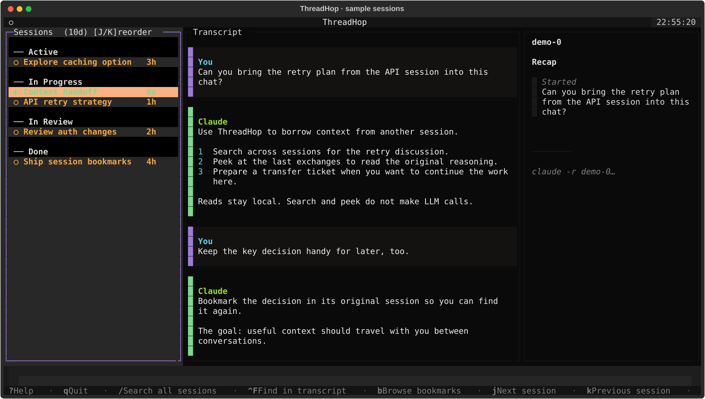

# ThreadHop 🚧 Under rework


**I'm rethinking and rebuilding ThreadHop.** A brief detour into a Rust port
wasn't the right fit for me. I'm now rewriting it in **TypeScript** and turning
it into an **MCP server**, with a smaller core focused on **cross-session
communication**: reading useful context, bookmarking it, and carrying it
between coding-agent conversations.

The rewrite is in progress on [`migration/typescript`](https://github.com/parzival1l/threadhop/tree/migration/typescript).
It currently has a file-based Claude transcript `peek` CLI; the MCP server and
new feature set are still being built. `main` continues to run the Python app.

## The working app

ThreadHop is a macOS terminal browser, CLI, and Claude Code plugin for browsing,
searching, and borrowing context across sessions. It includes status groups,
bookmarks, transcript selection, and a shared SQLite search index.



*The Python app, shown with sample conversations. The TypeScript rebuild is taking shape separately.*

## Install & run

```bash
curl -LsSf https://raw.githubusercontent.com/parzival1l/threadhop/main/install.sh | bash
threadhop
```

The installer installs `uv` if needed and puts `threadhop` in `~/.local/bin`.
For a local checkout with `uv` installed, run `./threadhop`.

```bash
threadhop peek <session> --last 3       # Read another session's exchanges
threadhop search "retry strategy"      # Search indexed conversations
threadhop prepare --session <id>       # Build a context-transfer ticket
threadhop receive <ticket>             # Read the ticket in another chat
threadhop bookmark --note "keep this"   # Save the latest indexed message
threadhop tag in_review                # Set the current session's status
```

`peek`, `search`, and `receive` make no LLM calls. `prepare` uses one Claude
Haiku call to summarize older context and preserves recent exchanges verbatim.
Commands targeting the current session detect it automatically inside Claude Code.
Use `threadhop --help` or a subcommand's `--help` for options.

To add the Claude Code slash commands after installing the CLI:

```text
/plugin marketplace add parzival1l/threadhop
/plugin install threadhop@threadhop
```

In the TUI, use `j` / `k` to navigate, `h` / `l` to switch panels,
`[` / `]` to resize the sidebar, and `?` for the full keyboard guide.

See [design decisions](docs/DESIGN-DECISIONS.md), the
[Claude Code plugin](plugin/README.md), or the
[TypeScript branch README](https://github.com/parzival1l/threadhop/blob/migration/typescript/README.md)
for more detail.
